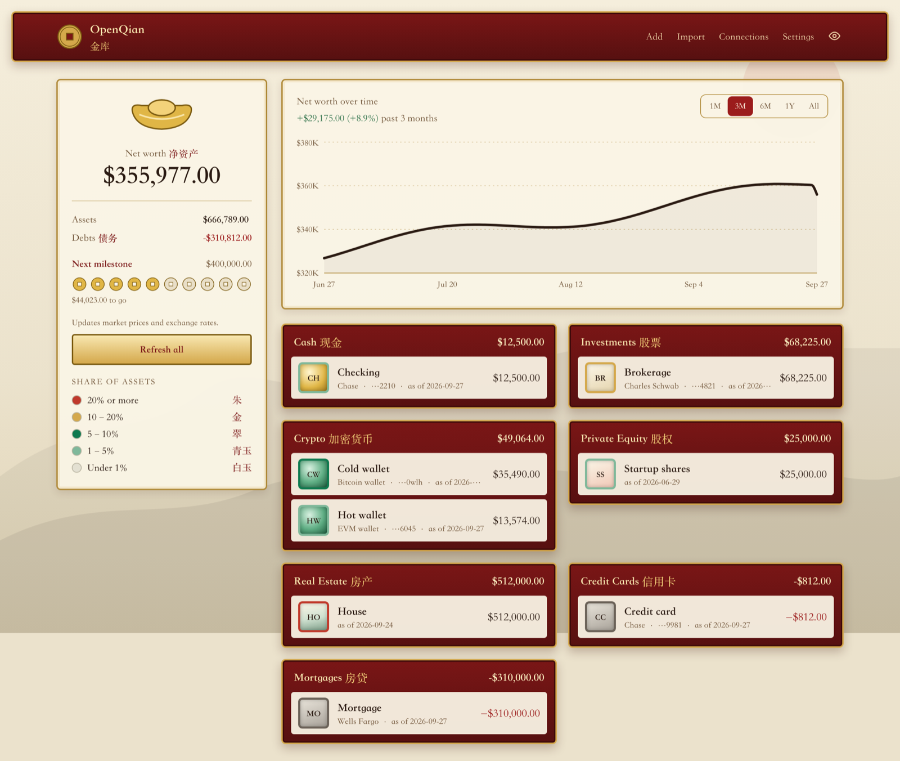
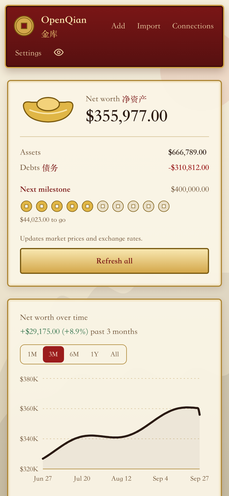

# OpenQian

A private, self-hosted net worth and portfolio tracker. Think Kubera, but it runs **only on your own computer**, costs nothing, and never moves money.

- **Local only.** One SQLite file on your machine; the app listens on `127.0.0.1` and has no cloud backend or telemetry.
- **Free.** No subscriptions, no paid APIs, no API keys required to get started.
- **No middlemen.** No bank-aggregator logins (Plaid, SnapTrade, …). Data comes from files you download, read-only keys you create, public blockchain data, or what you type in.
- **View-only.** It can't trade, transfer, or sign anything.

<p align="center">
  
  
</p>
<p align="center"><sub>Sample data. Try it yourself with <code>pnpm demo</code>.</sub></p>

The look is inspired by 2000s Chinese MMOs: a treasury (金库) of red lacquer and gold, with 钱 (*qián*, money) as its square-holed coin emblem. Tiles are bordered by their share of your assets, from white jade (白玉, under 1%) to vermilion (朱, 20% or more).

## What it does

- **Net worth dashboard** — assets, debts, and net worth by category, with a history chart (1M–All).
- **Accounts of every kind**
  - *Single-value* accounts with dated history: bank balances, real estate, cars, loans, private shares (value or quantity × price per share).
  - *Holdings* accounts: stocks, ETFs, funds, crypto — priced automatically.
- **Import files** from your bank or brokerage: positions exports (`.csv`, `.xlsx`) and Quicken downloads (`.qfx`, `.ofx`). Re-importing updates the same account.
- **Crypto exchanges** (Coinbase, Kraken, Gemini, Binance.US) with read-only API keys.
- **Crypto wallets** by public address: Ethereum, Base, Arbitrum, Solana, Bitcoin. The network is shown on every holding.
- **Multi-currency** with a base currency of your choice and automatic exchange rates.
- **Refresh all** — one button updates exchange and wallet balances, market prices, and exchange rates, and records a daily snapshot.
- **Private mode** — the eye button hides every number behind `*****` so you can use it in public.

## Quick start

### 1. Install the prerequisites

You need **Node.js 24 or newer** and **pnpm**.

- **macOS / Linux:** install Node with [nvm](https://github.com/nvm-sh/nvm) (`nvm install 24`) or from [nodejs.org](https://nodejs.org).
- **Windows:** install Node 24 from [nodejs.org](https://nodejs.org).

Then enable pnpm (it ships with Node):

```sh
corepack enable pnpm
```

### 2. Download and build

```sh
git clone https://github.com/montycheese/openqian.git
cd openqian
nvm use            # if you use nvm; reads .nvmrc
pnpm install
pnpm build
```

### 3. Run it

```sh
pnpm start
```

Open **http://127.0.0.1:3000**. Stop it with `Ctrl+C`; run `pnpm start` again whenever you want to use it.

Want to look around first? `pnpm demo` runs the app with a sample portfolio in a throwaway database (your real data is never touched).

> Prefer help? See [Set up with an AI agent](#set-up-with-an-ai-agent).

## First-time setup

1. **Settings → Base currency.** Totals and charts are shown in this currency.
2. **Add accounts** for anything without a file or API — a house, car, private company shares, a mortgage. Enter debts as positive amounts in a debt category.
3. **Import** your bank and brokerage files (see [where to download them](#where-to-download-files)). The preview shows what was found; choose a new or existing account and click Import. Download a fresh file and import again whenever you want to update.
4. **Connections → exchanges.** Create a *read-only* API key on the exchange's website and paste it in. For Coinbase, create a key with **View** permission only; keys that can trade or transfer are refused. Keys are encrypted on your computer.
5. **Connections → wallets.** Paste a public address (never a private key or seed phrase). For `0x…` addresses, tick the networks to track.
6. **Dashboard → Refresh all** to load prices, exchange rates, and balances. Do this whenever you open the app; your net worth history builds up day by day.

### Where to download files

Menu names change over time, but these are the usual places. Look for "Download", "Export", or "Quicken".

| Institution type | What to download | Typical location |
|---|---|---|
| Banks & credit cards (e.g. Chase, Wells Fargo) | Quicken / Web Connect file (`.qfx`) | Account activity → Download → Quicken |
| Fidelity | Positions (`.csv`) | Positions → Download |
| Charles Schwab | Positions (`.csv`) | Positions → Export |
| Morgan Stanley | Holdings (`.xlsx`) | Holdings → Export to Excel |
| Other brokerages | Positions / holdings export (`.csv`, `.xlsx`, `.ofx`) | Positions or holdings page |

If a brokerage has no positions export, create a **holdings** account and add each ticker and quantity by hand; prices update automatically.

## Your data and privacy

- Everything is stored in one file, `openqian.db`:

  | OS | Location |
  |---|---|
  | macOS | `~/Library/Application Support/OpenQian` |
  | Linux | `$XDG_DATA_HOME/openqian` (default `~/.local/share/openqian`) |
  | Windows | `%APPDATA%\OpenQian` |

  Set `DATA_DIR=/some/folder` before `pnpm start` to use a different location.
- **Back up** by copying that file while the app is stopped. Avoid cloud-synced folders unless you're comfortable with that.
- **Exchange API keys** are encrypted with a key kept in your operating system's keychain. Where no keychain is available (e.g. some Linux servers), set `OPENQIAN_PASSPHRASE` to derive the key from a passphrase instead.
- **What goes over the internet:** only requests you trigger by refreshing — market prices (Yahoo Finance, CoinGecko, Coinbase public data), exchange rates (Frankfurter), your exchanges (with your read-only key), and public blockchain endpoints for wallet balances. Those providers can see what's requested (e.g. which tickers or wallet addresses); none of them receive your net worth or other accounts. Imported files never leave your computer and aren't kept after import.
- **Private mode** hides numbers from people looking at your screen. It is not encryption — anyone with access to your computer can read the database.

## Updating

```sh
git pull
pnpm install
pnpm build
pnpm start
```

Database changes are applied automatically when the app starts.

## Troubleshooting

- **`pnpm: command not found`** — run `corepack enable pnpm`.
- **Build errors mentioning Node** — check `node -v` is 24 or newer.
- **"Couldn't access the OS keychain"** — set `OPENQIAN_PASSPHRASE` and restart.
- **Prices show `$0` with a "rate limit" note** — the free price services limit how often you can ask; wait a minute and click Refresh all again. Last known prices are kept in the meantime.
- **A wallet chain fails to load** — public endpoints are occasionally down. Add your own endpoint in *Settings → Blockchain endpoints* (e.g. a free key from an RPC provider).
- **An import finds nothing** — make sure it's a positions/holdings export (not transactions), or a Quicken `.qfx` for bank balances.
- Still stuck? Run `pnpm verify` and check the first failing step.

## Set up with an AI agent

AI coding agents (Claude Code, Cursor, Codex, and others) can install and set up OpenQian for you. This repository includes [`AGENTS.md`](AGENTS.md) with step-by-step instructions written for agents.

Open the project folder in your agent and ask something like:

> Help me set up OpenQian on this computer. Follow the "Helping a user set up OpenQian" section in AGENTS.md: check prerequisites, install, build, and start it, then walk me through the first-time setup.

The agent can install dependencies, run and verify the app, explain where to find your bank's download buttons, and fix problems. **Never give an agent your bank passwords, exchange API secrets, or seed phrases** — enter those into OpenQian yourself.

## Development

```sh
pnpm dev          # dev server with hot reload (one per project folder)
pnpm demo         # production build with a sample portfolio (after pnpm build)
pnpm verify       # typecheck, lint, tests, production build, and a smoke test of every page
pnpm test         # unit + integration tests
pnpm db:generate  # create a migration after editing src/lib/db/schema.ts
```

See [`AGENTS.md`](AGENTS.md) for architecture, conventions, and contribution guidelines (useful for humans too), and [`PLAN.md`](PLAN.md) for scope and design decisions. Commits follow [Conventional Commits](https://www.conventionalcommits.org/).

## License

MIT
